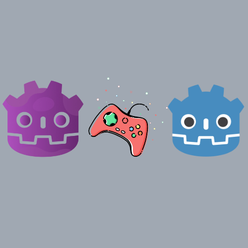

# MultiplayerExperiment

<div align="center">
	
</div>

Welcome to MultiplayerExperiment, a Godot-based project exploring multiplayer functionalities. While still a work in progress, this repository demonstrates the potential of multiplayer implementation in Godot, despite some existing bugs and crashes.

## Video 🎥
[](https://youtu.be/VBpq_zx8DJI)

## Download 📥
You can either download the repo, or just clone it:

```bash
git clone https://github.com/yunusey/MultiplayerExperiment.git
cd MultiplayerExperiment
```

Once downloaded, you can import it into the Godot editor to get started!

## Playing 🎮
To play the game, 
1. Open the project in the Godot editor and run it
2. Either host the server, or join a game. If you are hosting, just press the "Host Game" button. If you are joining, enter the ip address of the host (it should be in 192.168.*.* format).
3. You can send and receive messages from other players, using the chat box.
4. Whenever you are ready, press "Esc" to toggle focus on the chat box, then press "Space". When everyone is ready, the game will start.
5. Move with the WASD keys.

## License 📃
This project is licensed under the MIT License, granting you the freedom to use and distribute it for any purpose.

## Features ✨
MultiplayerExperiment showcases the following key features:
- Real-time chat functionality enabling communication among players.
- Basic implementation of a multiplayer game.

## Contributing 🤝
Contributions of all forms are highly appreciated! Here are some areas where you can contribute:
1. `Fix MultiplayerSynchronizer`: Address issues related to player synchronization and messaging upon joining the game.
2. `Enhance User Interface`: Improve the UI design for a more engaging and user-friendly experience.

Feel free to open issues, submit pull requests, or suggest improvements. Your input is invaluable to this project's growth.

## Final Words 💬
Thank you for exploring MultiplayerExperiment! If you find this project interesting or useful, consider leaving a ⭐️ to show your support. Your feedback helps motivate further development and encourages others to engage with this project.
